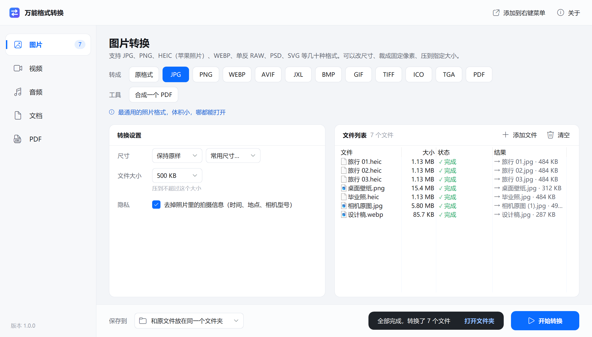

<p align="center"></p>

# 万能格式转换（OmniConvert）

一个装得下所有格式的小工具箱：图片、视频、音频、Word / Excel / PPT、PDF，常见格式之间都能互相转换。还能把图片裁成固定像素（比如一寸照 295×413）、把照片和视频压到指定大小、PDF 转 Word / 合并 / 拆分 / 压缩 / 加密。原生 Windows 程序，所有转换都在你自己的电脑上完成，文件不会上传到任何地方。

[English](README.md) · [下载](https://github.com/haoawake/omni-convert/releases/latest)



## 能做什么

| 类型 | 转成 | 还能 |
|---|---|---|
| **图片** | JPG、PNG、WEBP、AVIF、JXL、BMP、GIF、TIFF、ICO、TGA、PDF | 读得懂 iPhone 的 HEIC、单反 RAW（CR2/CR3/NEF/ARW/DNG…）、PSD、SVG 等几十种格式；改尺寸、**裁成固定像素**（裁剪填满 / 等比缩放 / 留白 / 拉伸）、**压到指定大小**（比如 200 KB 以内）、去掉照片里的拍摄地点等信息、多张图片合成一个 PDF |
| **视频** | MP4、MKV、MOV、AVI、WEBM、FLV、WMV、M4V、TS、MPG、3GP、GIF 动图、WEBP 动图 | H.264 / H.265 / AV1 编码，**压到指定大小**（比如 25 MB 以内发邮件），改分辨率（含竖屏、方形、自定义），截取片段，改帧率，去掉声音，NVIDIA / AMD / Intel 显卡加速 |
| **音频** | MP3、M4A、AAC、WAV、FLAC、OGG、OPUS、WMA、AIFF、AC3、AMR、苹果铃声 M4R | **直接从视频里提取声音**，改音质、采样率、声道，压到指定大小，截取片段，音量标准化 |
| **文档** | PDF、DOCX、DOC、RTF、ODT、TXT、HTML、XLSX、XLS、CSV、ODS、PPTX、PPT、ODP、图片、长图、视频 | Word / Excel / PPT / TXT / Markdown / 网页互转，**PPT 转视频**，任何文档转成一页页图片或一张长图 |
| **PDF** | Word、Excel、PPT、JPG、PNG、长图、TXT | **合并、拆分**（每页一个 / 每几页一个 / 按页码范围提取）、**压缩**（无损 / 推荐 / 强力）、加密、解密、旋转 |

## 怎么用

1. **下载**（[Releases 页面](https://github.com/haoawake/omni-convert/releases/latest)）里的 `OmniConvert-win-x64.zip`，右键 →「全部解压缩…」，放到一个固定的位置。
2. **双击「万能格式转换.exe」。** 第一次运行如果提示「Windows 已保护你的电脑」：点「更多信息」→「仍要运行」。
3. **把文件拖进窗口**（文件夹也行，会把里面认识的文件都加进来），或者点「添加文件」，或者在资源管理器里复制文件后回到窗口按 `Ctrl+V`。文件会自动放进对应的页（图片、视频……）。
4. 上面选**转成**什么，左下调好**转换设置**，点**开始转换**。结果默认和原文件放在同一个文件夹，名字一样（重名时自动加上「(1)」），**永远不会覆盖原文件**。

> `tools` 文件夹里是转换用的组件（FFmpeg、ImageMagick、PDFium），要和程序放在一起，别删。

### 小技巧

- **右键菜单：** 点右上角「添加到右键菜单」，以后在文件上点右键 →「用万能格式转换打开」（Windows 11 要先点「显示更多选项」）。一次选中很多文件也只会打开一个窗口。
- **常用尺寸：** 图片的「尺寸」里有一寸照、二寸照、头像、壁纸、小红书、公众号封面等预设，选了就是正好那个像素。
- **列表右键：** 打开转换结果、在文件夹中显示、查看失败原因、上移 / 下移（合并 PDF、合成 PDF 时决定顺序）、重新转换。双击转换完成的文件直接定位到结果。
- **不会重复转换：** 同一批文件用同样的设置转过一次后再点「开始转换」不会重复生成；改了设置或目标格式再点就会转新的。
- 转换时电脑不会自动睡眠，任务栏按钮上能看到总进度。

## 常见问题

**Word、Excel、PPT 转换需要装什么？**
需要电脑上装有 Microsoft Office、WPS 或 LibreOffice（任选一个；LibreOffice 免费）。程序会在后台悄悄调用它们，不会弹出窗口，也不会改动你的原文件。CSV 转 Excel、Excel 转 CSV、Markdown 转网页不需要 Office。

**PDF 转 Word 效果怎么样？**
用的是 Word 自己的「PDF 重排」功能，文字、段落、表格基本能还原成可编辑的样子；扫描件（每页是一张图片）没有文字可识别。没有装 Word 时只能提取文字。

**压到指定大小为什么有时会失败？**
图片会先降低画质、不够再缩小尺寸；视频会按时长算出码率，太小时自动降低分辨率。但如果目标实在太小（比如 1 小时的视频压到 5 MB），会直接告诉你最小能压到多少，不会给你一个糊成一片的结果。

**HEIC 能转，为什么不能转成 HEIC？**
HEIC 编码受专利限制，免费组件里没有可以分发的编码器。想要体积小的格式可以选 AVIF 或 WEBP。

**转换失败了怎么办？**
在列表里双击失败的那一行（或右键 →「查看失败原因」）能看到原因和技术细节。常见原因：文件本身损坏、PDF 有密码（在「密码」里填上）、Office 文件有打开密码。

**会不会把文件传到网上？**
不会。所有转换都用本机的组件完成，程序不联网。

## 从源码构建

需要 Go 1.26 或更新版本，以及 7z（解压 ImageMagick 用）。

```bash
bash scripts/fetch-tools.sh   # 下载 FFmpeg、ImageMagick、PDFium 到 tools/
go test ./...
bash scripts/build.sh 1.0.0   # 生成 dist/OmniConvert-win-x64.zip
```

命令行模式：`万能格式转换.exe -list` 列出所有转换，`万能格式转换.exe -to img:jpg -set size=204800 照片.heic` 直接转换。

## 许可

[MIT](LICENSE)。附带的组件各有许可证：FFmpeg（GPL，源码见 ffmpeg.org）、ImageMagick（ImageMagick License）、PDFium（BSD）、pdfcpu（Apache 2.0），许可证文件在 `tools` 各文件夹里。
